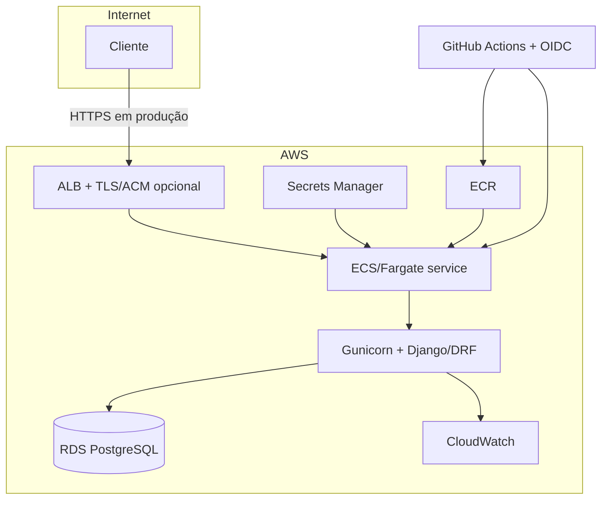

# Arquitetura e decisões técnicas

## Visão geral

O monólito modular é deliberado: o domínio é pequeno, o ciclo transacional é simples e uma única aplicação reduz custo operacional. A separação em apps Django preserva limites de domínio e permite extrair serviços no futuro apenas quando houver necessidade comprovada.

## Fluxo de uma requisição

1. O ALB termina TLS e encaminha somente tráfego saudável.
2. Middlewares do Django validam host, CORS e configurações de segurança.
3. A autenticação identifica a pessoa ou integração chamadora.
4. ViewSets do DRF aplicam permissões, filtros e paginação.
5. Serializers validam e normalizam a entrada.
6. Models acessam PostgreSQL exclusivamente pelo ORM.
7. A resposta é serializada como JSON; eventos técnicos vão para logs com metadados em chave/valor e formatter JSON em produção.

## Decisões

### Django + Django REST Framework

Fornecem ORM parametrizado, migrações, autenticação, validação, serializers, testes de API e um ecossistema maduro. Isso reduz código próprio em áreas sensíveis.

### PostgreSQL

Oferece integridade referencial, transações, índices e operação gerenciada via RDS. A chave estrangeira da consulta garante que não exista consulta vinculada a um profissional inexistente.

### Poetry

Mantém dependências diretas explícitas e versões resolvidas em lockfile. CI e imagem Docker devem instalar a partir do mesmo lockfile.

### REST, ViewSets e routers

Os recursos têm semântica HTTP previsível e rotas consistentes. O filtro por profissional permanece uma query string porque representa um subconjunto da coleção de consultas, sem criar um novo recurso.

### JWT de curta duração

Evita sessão no servidor e atende clientes desacoplados. O access token deve ter vida curta; refresh tokens precisam de rotação e blacklist quando habilitados. Para integração servidor-servidor, um provedor de identidade/OAuth 2.0 é uma evolução preferível a usuários compartilhados.

## Segurança

### SQL injection

O ORM do Django gera consultas parametrizadas, mantendo instrução SQL e valores separados. Valores de URL, query string e corpo nunca devem ser interpolados em SQL. Caso SQL bruto seja inevitável, use placeholders e parâmetros do driver; nunca f-strings, `%`, `.format()` ou concatenação.

Além disso:

- filtros usam campos previamente permitidos, não nomes de colunas fornecidos livremente pelo cliente;
- ordenação, quando disponível, tem allowlist;
- o usuário do banco da aplicação não é superuser e tem somente os privilégios necessários;
- erros de banco não são devolvidos ao cliente.

### Validação e sanitização

Sanitização não significa alterar silenciosamente dados válidos. Serializers rejeitam tipos, formatos e tamanhos inesperados, normalizam apenas o que a regra de negócio define e deixam o renderer JSON escapar a saída. Campos livres têm limites de comprimento. Conteúdo HTML não é interpretado pela API.

### Autenticação e autorização

- rotas de negócio exigem autenticação por padrão;
- permissões são declaradas globalmente e podem ser restringidas por endpoint;
- senhas usam os hashers do Django e nunca aparecem em resposta ou log;
- endpoints administrativos permanecem separados e protegidos;
- tentativas de autenticação e rotas sensíveis devem receber throttling.

### CORS e CSRF

CORS é uma regra de navegador, não um mecanismo de autenticação. Produção usa uma allowlist exata de origens HTTPS. `CORS_ALLOW_ALL_ORIGINS` deve permanecer falso. Como JWT é enviado no header `Authorization`, clientes não dependem de cookie para as rotas da API; se autenticação por cookie for adicionada, CSRF deve continuar habilitado e as origens confiáveis precisam ser explícitas.

### Configuração e segredos

- `DEBUG=false` em ambientes publicados;
- `ALLOWED_HOSTS` contém somente domínios esperados;
- `SECRET_KEY`, senha do banco e chaves externas ficam no Secrets Manager;
- GitHub Actions assume roles AWS por OIDC, sem access keys de longa duração;
- TLS é obrigatório e HSTS deve ser habilitado após validação dos domínios;
- dependências e imagem são verificadas periodicamente.

### Privacidade e logs

Endereço e contato podem constituir dados pessoais. Colete apenas o necessário, defina retenção e acesso e atenda solicitações de correção/remoção conforme política aplicável. Logs usam IDs técnicos e metadados mínimos; nunca incluem senha, JWT, payload integral, contato ou endereço. Um `request_id` permite correlação sem expor o conteúdo.

## Observabilidade

Registre em JSON: timestamp, nível, serviço, ambiente, método, rota normalizada, status, duração e request ID. Exponha health check que confirme o processo e, separadamente, readiness com dependências essenciais. Métricas e alarmes mínimos:

- taxa de respostas 5xx;
- latência p95;
- tasks não saudáveis;
- CPU e memória;
- conexões, armazenamento e latência do RDS;
- falhas de autenticação anormais.

## Disponibilidade e consistência

Por padrão, o Terraform cria duas tasks e um RDS privado, criptografado, com backups automatizados e senha mestra gerenciada pelo Secrets Manager. Produção deve habilitar Multi-AZ e manter proteção contra exclusão; staging pode ter capacidade menor. Escritas relacionadas usam transações. Índices acompanham chaves estrangeiras e filtros observados. Backups só contam como estratégia depois de testes periódicos de restauração.

## Limites atuais

O modelo mínimo do desafio não contém paciente, duração, status, timezone do profissional ou prevenção de conflito de agenda. Essas regras não devem ser presumidas silenciosamente; estão registradas como evolução em `DECISIONS_AND_IMPROVEMENTS.md`.
