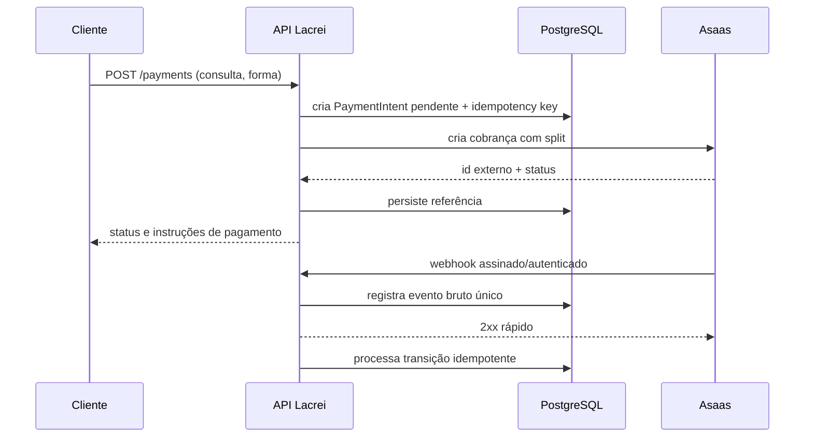

# Proposta de integração com Asaas e split de pagamento

> Esta é uma proposta arquitetural; não faz parte do CRUD principal. Antes da implementação, valide os campos, eventos, recursos de split e regras de negócio na documentação vigente do Asaas e no contrato da conta.

## Objetivo

Cobrar por uma consulta e dividir o valor entre a organização e a carteira do profissional, sem armazenar dados de cartão na API da Lacrei Saúde.

## Modelo sugerido

`Payment`:

- `id` interno (UUID);
- `appointment_id` único, conforme a regra de uma cobrança por consulta;
- `provider` (`asaas`);
- `external_payment_id` único;
- `amount`, `currency` e valores do split em unidades monetárias exatas (`Decimal`);
- `status` interno (`pending`, `confirmed`, `received`, `refunded`, `failed`, `cancelled`);
- `idempotency_key` única por operação de criação;
- timestamps.

`PaymentWebhookEvent`:

- ID do evento externo, quando disponível, com restrição única;
- hash determinístico do payload como proteção adicional contra duplicidade;
- tipo, versão, payload mínimo/criptografado, recebido/processado em;
- estado de processamento e erro sanitizado.

Não exponha o modelo do provedor diretamente ao restante do domínio. Um adapter traduz comandos e estados do Asaas para tipos internos.

## Criação idempotente

1. O cliente envia `Idempotency-Key` única.
2. A API grava a intenção e a chave em transação, com restrição única.
3. Repetições com a mesma chave e o mesmo payload retornam o resultado anterior.
4. A mesma chave com payload diferente retorna conflito.
5. A chamada ao Asaas usa a capacidade de idempotência/referência externa disponível.
6. Timeout é estado desconhecido, não falha definitiva: consulte pelo identificador antes de reenviar.

Uma constraint no banco é a garantia final contra corrida; cache sozinho não basta.

## Split

O recebedor deve estar previamente validado e mapeado a um identificador de carteira Asaas. A API calcula o split no servidor a partir de regras versionadas — nunca aceita percentuais arbitrários do cliente. Antes de criar a cobrança, valide:

- valor positivo e moeda permitida;
- soma dos splits igual ao total ou à parcela definida pelo contrato;
- arredondamento determinístico;
- recebedores ativos e elegíveis;
- impossibilidade de alterar split depois do estado limite definido pelo provedor.

Registre a versão da regra aplicada para auditoria. Estornos e chargebacks precisam refletir a mesma participação de cada recebedor, conforme suporte e regras do Asaas.

## Webhooks

O endpoint, por exemplo `POST /api/v1/webhooks/asaas/`, não usa JWT de usuário. Ele possui autenticação própria do provedor:

- valide token/assinatura conforme o mecanismo oficialmente suportado;
- compare segredos em tempo constante;
- aceite somente HTTPS;
- aplique limite de tamanho e rate limit;
- opcionalmente filtre IPs como defesa adicional, nunca como única validação;
- responda `2xx` rapidamente após persistir o evento;
- processe de forma assíncrona com retries e dead-letter queue;
- trate eventos fora de ordem por uma máquina de estados monotônica e reconciliação.

O evento é inserido com chave única antes de produzir efeitos. Duplicatas recebem `2xx` sem repetir transações. Payload inválido ou não autenticado recebe erro e é registrado sem dados sensíveis.

## Segurança e privacidade

- chave da API e segredo do webhook no Secrets Manager, com rotação;
- ambientes sandbox e produção em contas/configurações separadas;
- nunca registrar credenciais, token, dados bancários completos ou payload sensível;
- nunca receber dados brutos de cartão se checkout/tokenização hospedada puder ser usada;
- acesso operacional por menor privilégio e trilha de auditoria;
- política de retenção e base legal para dados pessoais e financeiros;
- conciliação diária compara estados internos e do Asaas.

## Falhas e reconciliação

Uma tarefa periódica consulta pagamentos pendentes ou divergentes e reconcilia o estado. Alterações financeiras usam transação e lock de linha quando necessário. Métricas mínimas:

- criação de cobrança por status;
- latência e erros do provedor;
- idade de pagamentos pendentes;
- webhooks inválidos, duplicados e falhos;
- divergências de conciliação.

Use retry com backoff exponencial e jitter somente em operações seguras/idempotentes. Um circuit breaker evita amplificar indisponibilidade do provedor.

## Plano incremental

1. adapter mockado e testes de contrato;
2. integração com sandbox do Asaas;
3. recebimento idempotente de webhooks;
4. conciliação e dashboards;
5. piloto com valores/usuários limitados;
6. produção com alertas, runbook, rotação de chaves e plano de estorno.
