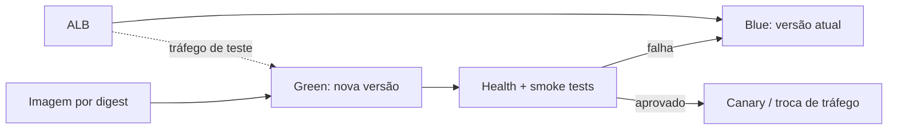

# CI/CD, AWS e rollback

## Ambientes

| Aspecto | Staging | Produção |
| --- | --- | --- |
| Objetivo | validação integrada | tráfego real |
| Gatilho | merge na branch principal | promoção manual/aprovação |
| Imagem | SHA do commit | mesma revisão SHA validada em staging |
| Infraestrutura | isolada | isolada e protegida |
| Banco | RDS PostgreSQL próprio | RDS PostgreSQL próprio, Multi-AZ conforme necessidade |
| Segredos | Secrets Manager próprio | Secrets Manager próprio |
| Domínio | subdomínio de staging | domínio de produção |

Nunca compartilhe banco, credenciais ou filas entre ambientes.

## Pipeline no GitHub Actions

Os workflows versionados são:

- `ci.yml`: lint, testes com PostgreSQL e build em pull requests e pushes para `main`;
- `quality-gate.yml`: gate reutilizável pelo deploy;
- `deploy.yml`: Terraform, build/push no ECR e atualização do ECS;
- `rollback.yml`: promoção manual de um SHA de imagem anterior.

### 1. Lint

- instala dependências pelo lockfile;
- valida o projeto Poetry com `poetry check --strict`;
- executa análise estática com `ruff check`.

### 2. Test

- inicia PostgreSQL como service container;
- verifica migrations pendentes com `makemigrations --check --dry-run`;
- executa os testes pelo runner do Django sob cobertura e exige o limite configurado de 90%;
- não usa segredos nem serviços de produção.

### 3. Build

- no CI, constrói a imagem de produção sem publicá-la;
- no workflow de deploy, reconstrói a mesma revisão e envia ao ECR do ambiente com o SHA completo;
- não reutiliza a tag `latest` como identidade de release.

### 4. Deploy de staging

- autentica na AWS por GitHub OIDC;
- aplica a infraestrutura Terraform e cria uma revisão da task definition com a tag imutável;
- o entrypoint executa migrações antes de iniciar cada nova task;
- atualiza o serviço ECS e aguarda estabilidade;
- o ALB e o ECS verificam `/health/ready/`, incluindo conectividade com o banco.

### 5. Deploy de produção

- exige aprovação do GitHub Environment;
- parte da mesma revisão SHA validada em staging e publica no ECR de produção;
- usa o mesmo fluxo Terraform/ECS e aguarda o serviço estabilizar;
- registra no GitHub o ambiente, a revisão e a pessoa que aprovou.

Jobs de pull request executam lint/test/build sem permissão de deploy. Configure proteção de branch, environments e revisores no GitHub; esses controles não são definidos nos arquivos YAML.

## Configuração inicial do repositório

Crie os GitHub Environments `staging` e `production`; produção deve exigir revisão. Em cada um configure:

| Tipo | Nome | Conteúdo |
| --- | --- | --- |
| variável | `AWS_REGION` | região AWS do ambiente |
| variável | `TF_STATE_BUCKET` | bucket S3 previamente criado para o estado Terraform |
| variável (produção) | `ACM_CERTIFICATE_ARN` | certificado ACM regional do domínio da API |
| variável (produção) | `APP_ENV_JSON` | mapa JSON público, incluindo `DJANGO_ALLOWED_HOSTS` |
| secret | `AWS_ROLE_ARN` | role assumida pelo GitHub OIDC |
| secret | `APP_SECRET_ARNS_JSON` | mapa JSON `VARIAVEL: ARN`; deve conter ao menos `DJANGO_SECRET_KEY` |

O bucket de estado é um pré-requisito do bootstrap: habilite versionamento, criptografia e bloqueio por lockfile, e restrinja acesso às roles de CI/CD. Edite os arquivos versionados `infra/environments/staging.tfvars.example` e `infra/environments/production.tfvars.example`, que são consumidos pelos workflows e não contêm segredos. Em produção, configure `ACM_CERTIFICATE_ARN` e um `APP_ENV_JSON` semelhante a `{"DJANGO_ALLOWED_HOSTS":"api.example.com","DJANGO_CORS_ALLOWED_ORIGINS":"https://app.example.com","DJANGO_CSRF_TRUSTED_ORIGINS":"https://api.example.com,https://app.example.com"}`. O plano falha de forma segura sem certificado e host explícito.

Antes do primeiro deploy, valide a infraestrutura localmente (sem criar recursos):

```bash
terraform -chdir=infra fmt -check -recursive
terraform -chdir=infra init -backend=false
terraform -chdir=infra validate
```

Um push em `main` dispara staging. Produção é iniciada em **Actions → Deploy → Run workflow**, selecionando `production` a partir da mesma branch/tag e revisão validada em staging; a aprovação ocorre pelo GitHub Environment.

## Identidade e permissões

GitHub Actions usa OIDC para assumir uma role curta por ambiente. A role de staging não pode alterar produção. As policies concedem somente operações necessárias em Terraform, ECR e ECS. Nenhuma chave AWS permanente é salva nos secrets do GitHub.

## Configuração de runtime

Valores não sensíveis ficam na task definition. Segredos adicionais vêm do Secrets Manager pelo mapa `secret_arns`; a senha mestra do RDS é gerada e gerenciada pela própria AWS e injetada como `POSTGRES_PASSWORD`. Cada alteração de configuração gera nova revisão implantável e auditável. A task da aplicação não recebe permissões administrativas na AWS.

O Terraform cria um RDS PostgreSQL criptografado em subnets sem IP público, acessível somente pelo security group das tasks ECS. A aplicação exige TLS na conexão com o banco. Backups, autoscaling de armazenamento, Multi-AZ e proteção contra exclusão são controlados por variáveis; para produção, mantenha `database_multi_az=true`, `database_deletion_protection=true` e `database_skip_final_snapshot=false`.

TLS público termina no ALB. Por isso a task mantém `DJANGO_SECURE_SSL_REDIRECT=false`: o listener da porta 80 faz o redirecionamento antes de chegar ao Django, enquanto os health checks internos continuam em HTTP. Produção exige `certificate_arn`; HSTS, cookies seguros e os demais headers continuam ativos no Django.

## Migrações

A implementação atual usa `RUN_MIGRATIONS=1` no entrypoint. As migrations do Django são idempotentes, porém várias novas tasks podem tentar aplicá-las ao mesmo tempo. Como melhoria antes de mudanças de schema complexas, execute migrations em uma task ECS única e controlada antes da troca de tráfego, deixando `RUN_MIGRATIONS=0` no serviço.

Para mudanças incompatíveis, use **expand/contract**:

1. expandir: adicionar coluna/tabela nova, mantendo a antiga;
2. implantar código que entende os dois esquemas;
3. migrar/backfill dos dados de forma observável;
4. trocar leituras e escritas;
5. somente em release posterior remover o esquema antigo.

Cada migração relevante precisa de plano de tempo, lock, backup e reversão. Evite rollback de banco automático quando houver risco de perda de dados.

## Estratégia de rollout implementada

O Terraform configura rolling update do ECS com no mínimo 100% e no máximo 200% da capacidade, health check e circuit breaker com rollback automático.

### Evolução recomendada: blue/green

Para reduzir mais o risco em produção, uma próxima etapa é adotar blue/green pelo CodeDeploy:



Nesse modelo futuro, o tráfego pode avançar em etapas (por exemplo, canary) enquanto alarmes observam 5xx e latência. Falhas devolvem 100% do tráfego ao target group anterior.

## Rollback

### Aplicação

1. interromper a promoção e identificar o último SHA saudável;
2. em **Actions → Roll back ECS → Run workflow**, escolher o ambiente e informar esse `image_tag`;
3. o workflow confirma que a imagem existe no ECR, gera o plano Terraform e atualiza o serviço;
4. aguardar estabilidade e executar health/smoke tests;
5. confirmar métricas e registrar incidente.

Como imagens e task definitions são imutáveis, o rollback não requer rebuild.

### Banco de dados

- se a migração foi aditiva e compatível, volte apenas a aplicação;
- se houve transformação reversível, execute uma migração de correção revisada;
- se há perda/corrupção, pause escritas e use point-in-time recovery para nova instância; valide antes de trocar a conexão;
- nunca execute `migrate app zero` automaticamente em produção.

Um rollback de aplicação não torna uma migração destrutiva segura; essa é a razão para expand/contract.

## Verificação pós-deploy

O workflow aguarda estabilidade do ECS. Complete a release com estas verificações manuais ou automatize-as em uma próxima iteração:

- health e readiness respondem sem erro;
- migrações esperadas estão aplicadas;
- autenticação funciona;
- criação, leitura e filtro funcionam com dados sintéticos dedicados;
- taxa de 5xx e latência permanecem dentro do limite;
- logs não contêm segredos ou stack trace público.

## Operação e recuperação recomendada

- RDS com backup automático, retenção definida e PITR;
- teste periódico de restauração em ambiente isolado;
- alarmes do CloudWatch encaminhados ao canal de plantão;
- runbook de incidente com responsáveis, comunicação e pós-mortem;
- política de retenção de imagens que preserve releases necessárias para rollback.
